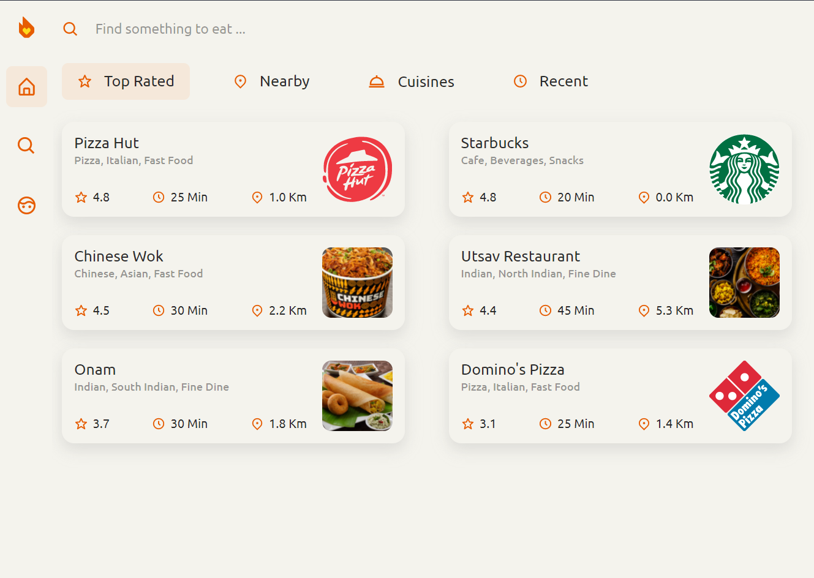
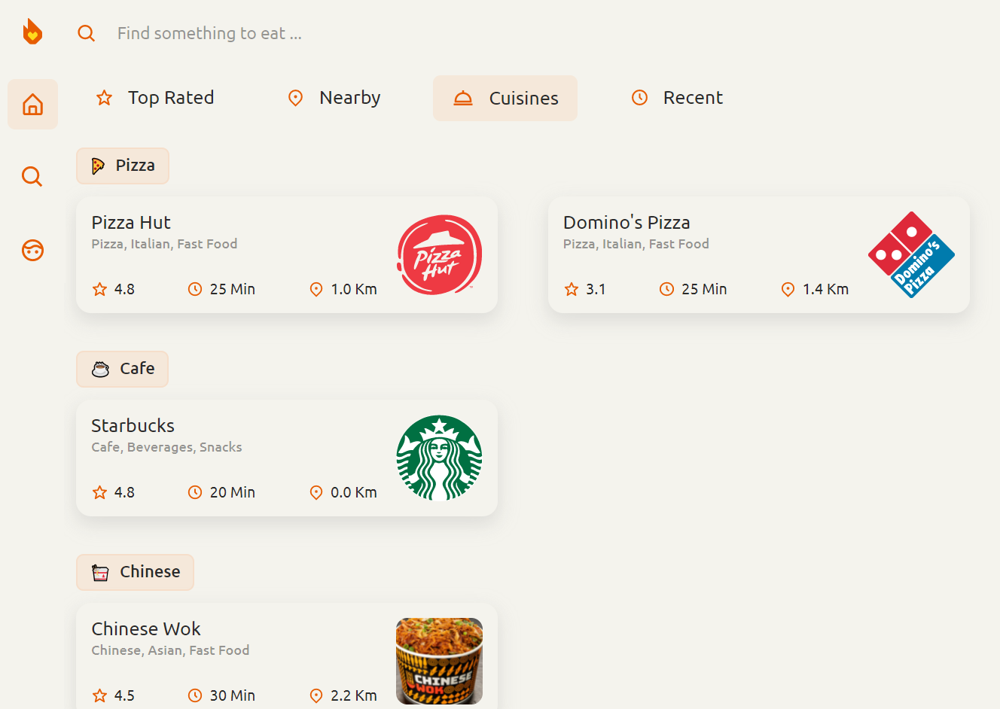
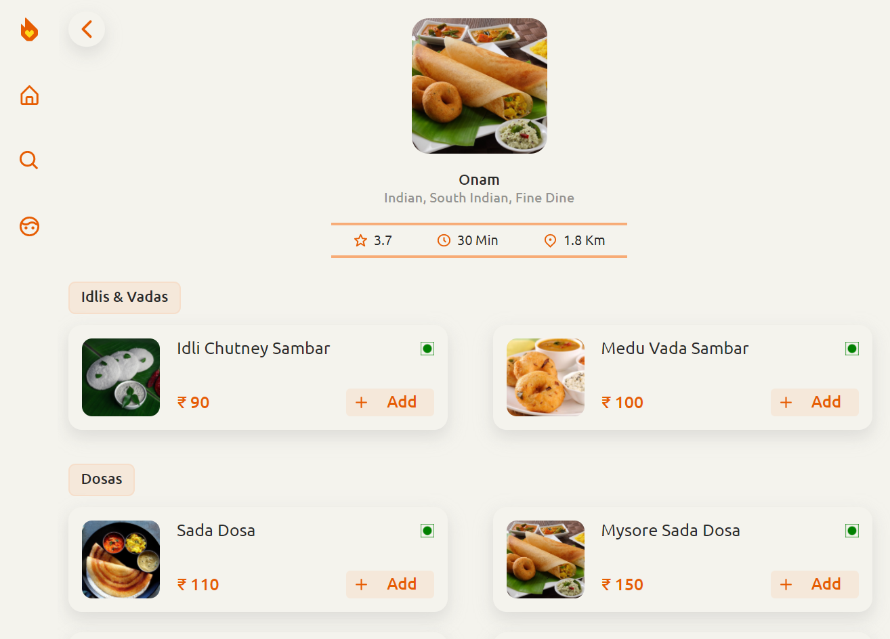
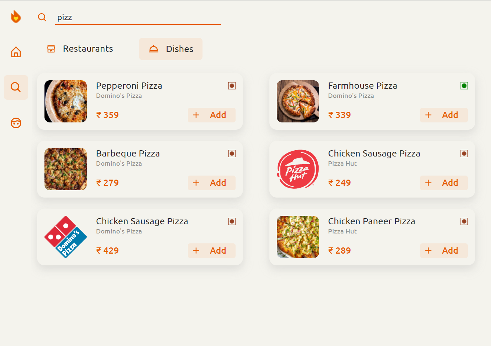
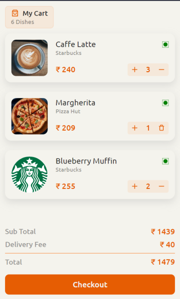
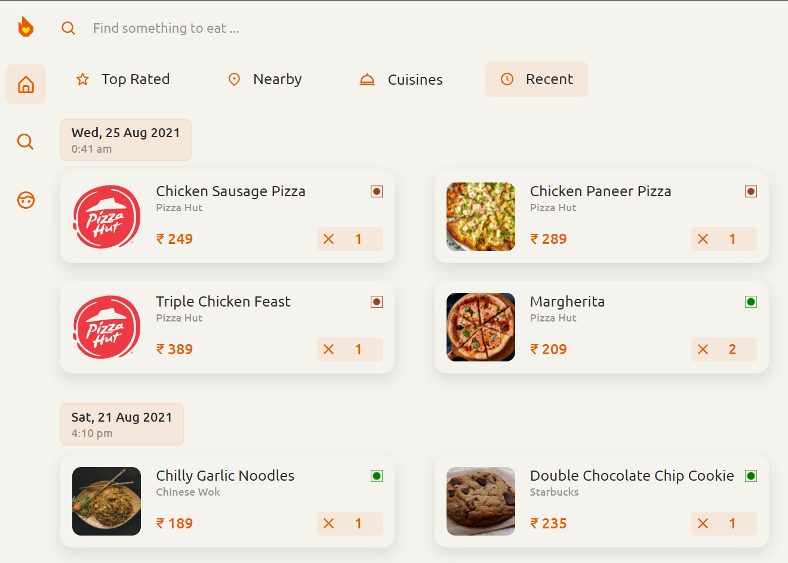

#  Foodmon

**[Foodmon App on Heroku](https://foodmon-external.herokuapp.com/)**.

Foodmon (name derived from nodemon), is a food ordering web app to find something to eat. \
You can browse restaurants, browse their menus of dishes, add dishes to your cart, modify quantities, and place your order! \
The web app supports both desktop and mobile devices.

Made for Devsoc, with ❤ by Ashmit.

## Features

### Browse Restaurants

Browse restaurants in the Top Rated, Nearby and Cuisine tabs.

_Top Rated tab_

 

_Cuisines tab_

### Browse Restaurant Menus

Browse dishes in the various sections of each restaurant's menu. Add your favourite dishes to your cart.

### Search for Restaurants and Dishes

Find your favourite restaurants and dishes.

### View your Cart

See what you added, modify quantities, review the total price, and place your order!

### View your recent orders

See when and what your ordered recently.

## Things I learnt while making Foodmon

### First time I've fully worked on the backend

Express, middleware, routing, and some error handling. \
MongoDB, queries/aggregation, searching, mongoose, and schemas. \
Passportjs + Google oauth authentication, and session cookies. \
Using Postman more effectively.

### Learnt more about using React and CSS

Component composition and SCSS modules for cleaner code. \
Context API, custom hooks, and reducers. \
Responsive layouts using media queries and a custom hook. \
Adding proper login/logout using backend authentication and cookies.
